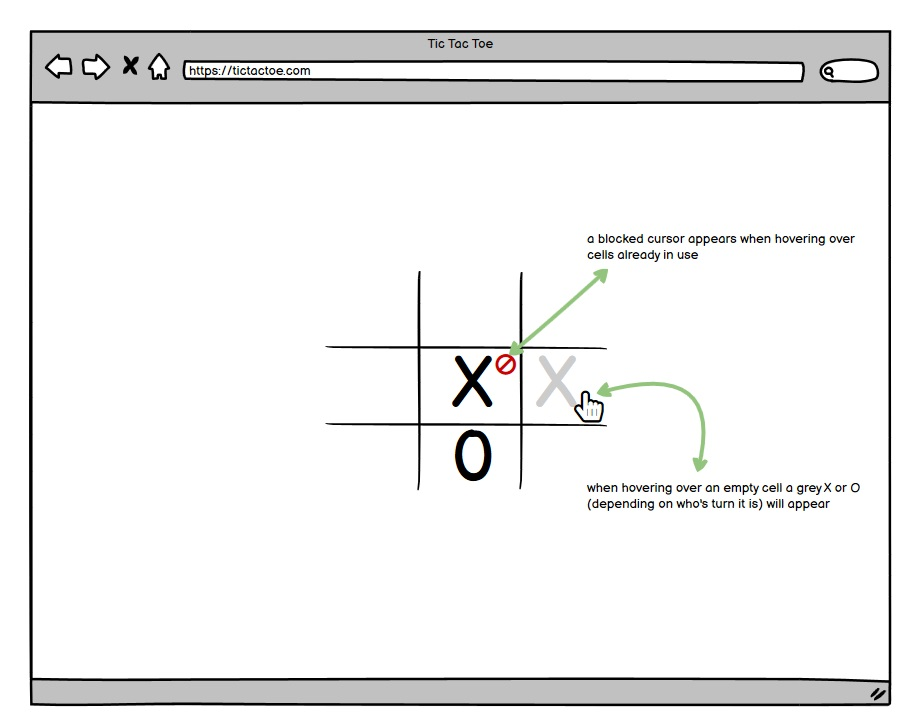
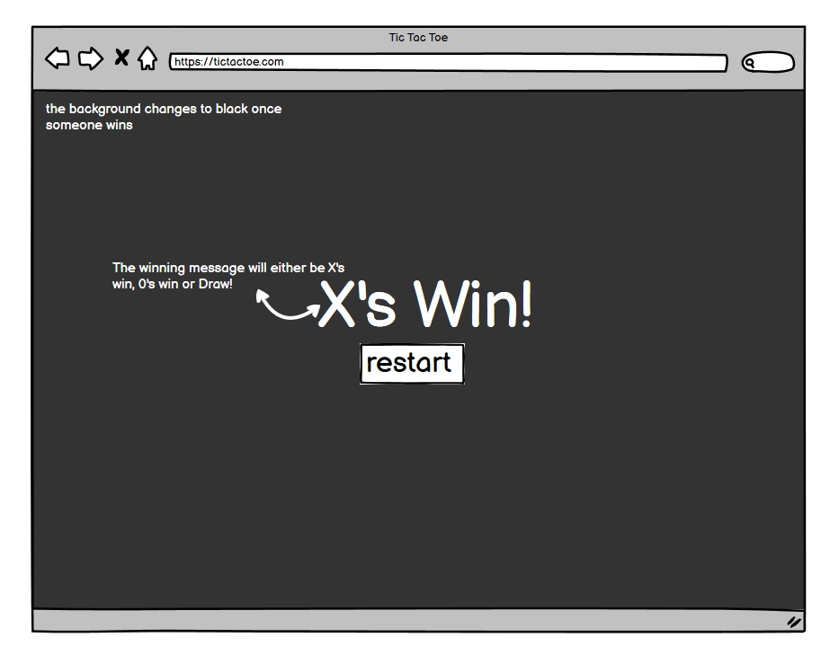
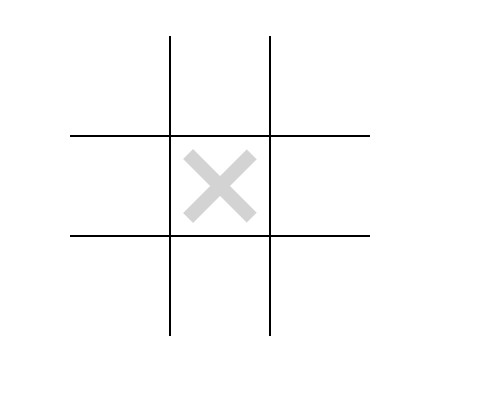
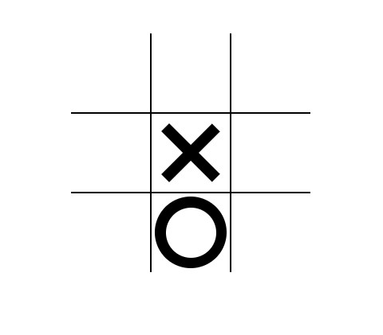

# TIC TAC TOE 

## Overview
This app was created for my second milestone project with The Code Institute where I demonstrate what I have learnt so far on their web development course. It is a interactive front end website using HTML, CSS and JavaScript. The websites goal is to be intuitive, user friendly, simple to use and fun. The game is suitable for anyone but it's minimalist design is to be more appealing to adults, to keep give them something to do either on their breaks at works or on the commute or just winding down in the evening. The idea is that it is a super simple, calm game that is familiar and the design is uncluttered and not over stimulating to help rest the mind.

LIVE LINK | 

## Wireframes

The website was designed on a wireframe software called Balsamiq.

### The main page of the webpage:

### The winning message page:

## Features

- The website is a black and white theme with a white background and black text
- There is a table in the centre of the screen with 9 cells, 3 across and 3 down.

- When you hover over the cells in the grid there is a hover effect showing a grey X when it's X's turn and a grey 0 when its 0's turn.

 

- The X or 0 then becomes black once the user clicks the chosen cell

- A 'blocked' cursor appears over the cells which are already in use when they're hovered over to make it clear that these cells can not be used
- When somebody wins a black background covers the screen and a message appears saying either "X's Win!" / "0's Win!" / "Draw!"

 

- There is a restart button under the winning message that takes you to the start of a new game

## Responsivity
This app has been trialled and tested on many devices and is fully responsive. No code was required to make the website responsive as it already worked on all devices so nothing needed to be rearranged or made compatible.It is fully responsive on all the following devices manually:
    - 24 inch screen for windows 10 PC
    - 17 inch screen for windows 10 PC
    - Macbook Air
    - Iphone 7
    - ASUS TUF-FX516PE-HN055T 15.6inch screen
- The responsivity was also responsive to the following devices using Google Development tools
     - iPhone SE
     - iPhone XR
     - iPhone 12 Pro
     - Pixel 5
     - Samsung Galaxy S8+
     - Samsung Galaxy S20 Ultra
     - iPad Air
     - iPad Mini
     - Surface Pro 7
     - Surface Duo
     - Galaxy Fold  
     - Samsung Galazy A51/71
     - Nest Hub 
     - Nest Hub Max

