# TIC TAC TOE 

## Overview
This app was created for my second milestone project with The Code Institute where I demonstrate what I have learnt so far on their web development course. It is a interactive front end website using HTML, CSS and JavaScript. The websites goal is to be intuitive, user friendly, simple to use and fun. The game is suitable for anyone but it's minimalist design is to be more appealing to adults, to keep give them something to do either on their breaks at works or on the commute or just winding down in the evening. The idea is that it is a super simple, calm game that is familiar and the design is uncluttered and not over stimulating to help rest the mind.

LIVE LINK | 

## User Experience (UX)

### User Stories

- As a user, I want to easily understand the main purpose of the app so that I can be sure it's what I was looking for.
- As a user who is an adult and not necessarily very techy, I want to be able to navigate the game easily and intuitively, so that the game is fun and easy and not overcomplicated.
- As a user who is using the app on my lunch break, I want the design to be simple, so that it's a calm game that's not overstimulating.

## Wireframes

The website was designed on a wireframe software called Balsamiq.

### The main page of the webpage:

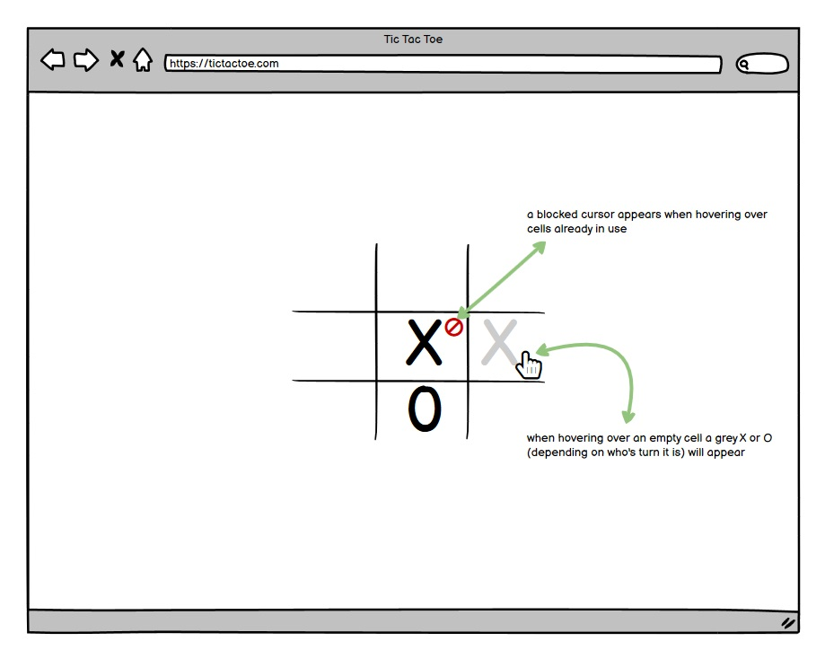

### The winning message page:

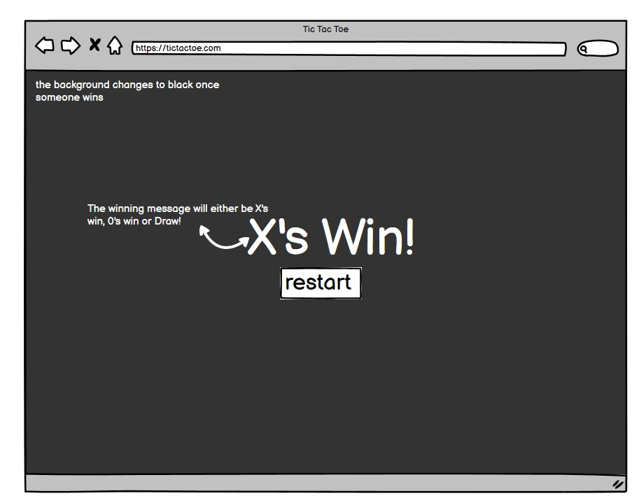

## Features

- The website is a black and white theme with a white background and black text
- There is a table in the centre of the screen with 9 cells, 3 across and 3 down.

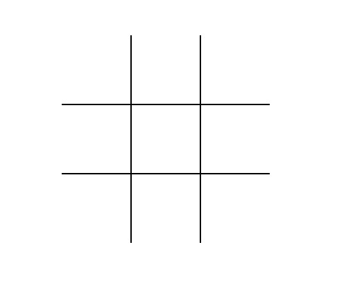

- When you hover over the cells in the grid there is a hover effect showing a grey X when it's X's turn and a grey 0 when its 0's turn.

 
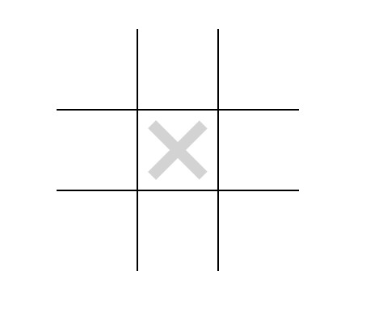

- The X or 0 then becomes black once the user clicks the chosen cell

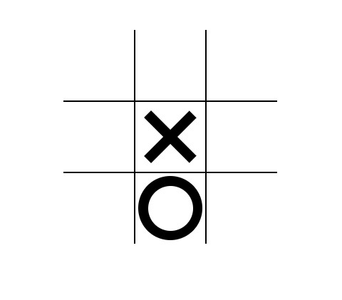

- A 'blocked' cursor appears over the cells which are already in use when they're hovered over to make it clear that these cells can not be used
- When somebody wins a black background covers the screen and a message appears saying either "X's Win!" / "0's Win!" / "Draw!"

 
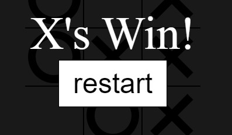

- There is a restart button under the winning message that takes you to the start of a new game

## Responsivity
This app has been trialled and tested on many devices and is fully responsive. No code was required to make the website responsive as it already worked on all devices so nothing needed to be rearranged or made compatible.It is fully responsive on all the following devices manually:
  - 24 inch screen for windows 10 PC
  - 17 inch screen for windows 10 PC
  - Macbook Air
  - Iphone 7
  - ASUS TUF-FX516PE-HN055T 15.6inch screen

The responsivity was also responsive to the following devices using Google Development tools
 - iPhone SE
 - iPhone XR
 - iPhone 12 Pro
 - Pixel 5
 - Samsung Galaxy S8+
 - Samsung Galaxy S20 Ultra
 - iPad Air
 - iPad Mini
 - Surface Pro 7
 - Surface Duo
 - Galaxy Fold  
 - Samsung Galazy A51/71
 - Nest Hub 
 - Nest Hub Max

## The Process
 
 Initially the html is almost completely invisible to the webpage, the only thing appearing is the restart button

 
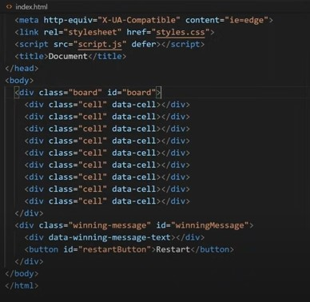

 
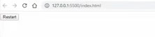

So I then started adding some CSS styling to the webpage to begin making it look like the wireframe I made.

The first thing I did was set up some basic box sizing. I did this by adding the everything selector and everything that is going to be before and after. This essentially selects absolutely everything and makes styling the widths and heights a lot easier. 

 
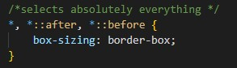

I then removed the margins so that the black background in the winning message would be easier to put in place

 
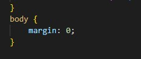

The next thing I worked on was the actual board which is the element that wraps all of the cells. The settings allow the board to be easily centred in the middle of the screen in a 3x3 grid.

 
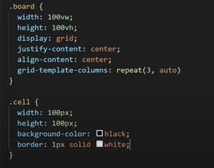

 
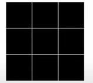

 
 To easily modify things with the width and height and make sure that everything is automatic I created some root variables. The first variable I created was the cell width. I then created a mark size which to modify the size of the x's and 0's. I decided to make the mark size 90% of the cell size so that the x's and 0's are slightly smaller than the the cells

 
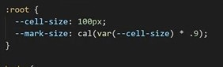

I then changed the colour of the cells as I didn't want them to be black, I changed the cell colour to white and the boarder colour to black and removed the borders from around the grid.

 
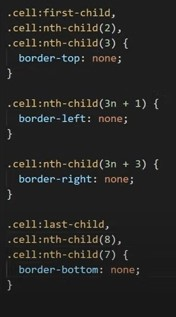

so now the board itself looks how I want it to look for the completed project.

I then began styling in an X. So instead of just typing an X into the cell and worrying about what style to use and it looking different on different devices and being hard to centre, instead I used just CSS and pseudo elements to create the X shape. Although upon reflection now I don't think I wouold use this method again which I will explain later in the README in the debugging section.

To  make the X I  firstly created this shape in the cell

 
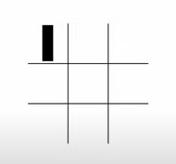

using the code.

 
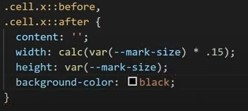

Because there is two of the lines one on top of the other to create the X shape I just rotated each line 45 degrees in opposite directions.

 
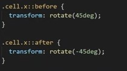

Next, I made the circle element. I started with this code:

 
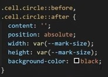

 which created this square in the boards cell

  
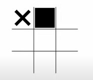

and then the following code:

  
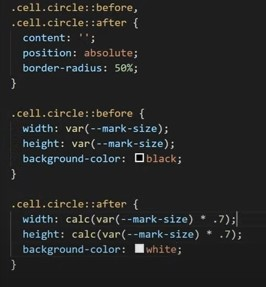

which creates the perfect circle.

  
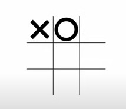

Next I added the 'not allowed' cursor for when the user hovers over the cells which were already filled:

  
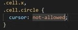

  

I then added the grey X and 0 hover effect to the cells that are not in use:
  
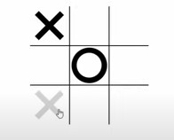

In order to do this I added a hover effect to the cells. Firstly I selected the board when it has the X class applied to it and got the cells inside of that board and add the hover effect to them . I basically just needed the same code that I used to create the X's and just changed the background color. So I added the hover::before and hover::after elements to the exact same code. 
  
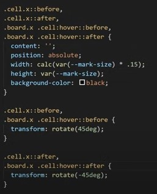

Although as you can see this causes it to happen on all of them, even the ones that are already filled in:

  
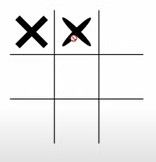

What I want it to do is make sure it only works when I hover over an empty cell that doesn't have an X or an 0 in it. This is where I used the "not" selector.

  
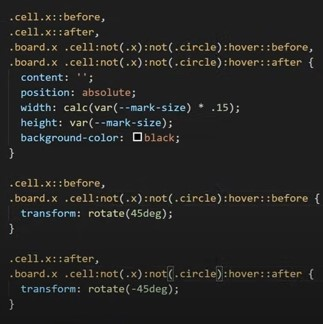

Now when I hover over the X or 0 it's not overriding what I've already done. It's not doing the hover effect because it's checking the "not" selector first.

All I have to do then is change the hover color to grey:
  
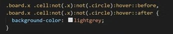

This didn't actually work because I already had black being defined below it and overriding it so I removed that and defined this code above the other selector.

  
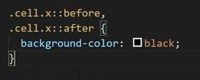

So now I have a grey X that hovers over the empty cells when using the X board. I then repeated the whole process for the circle board for the same outcome with a grey circle hovering effect.

The very last thing I had to style was the winning message.
I selected the winning message div that I created and made sure it was always at the center of the screen. I then added a background that was black and 90% transparent so that there's a black overlay covering the screen. I also made sure that the restart button was positioned in the center. I made the text white and increased the font size so that the winning message is clear. 

  
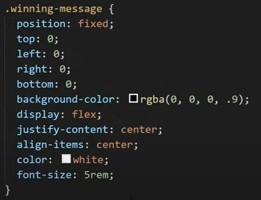

  

I then styled the winning message button too. I centred it by adding flex-direction: column to the winning-message. I also added a hover effect so that the colors invert once hovered over.

  
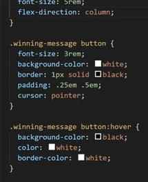

  

The last thing to do is to just be default to make a display of none because I don't want this message to show up by default so i added this to the winning message css code:

  
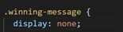

and added the display:flex to a seperate class so that it only displays the winning message when it's giving the class "show".

  

Once I finished styling the webpage I then started on making the page interactive using Java Script.

Firstly I selected all the different cells and added an event listener everytime a cell is clicked on. This event listener makes sure that the cell can only be clicked on once and it doesn't fire up the event if it's clicked on again.

  

I went on to create a function that handles the click.
Inside of this function I had to do quite a few things, the first thing we need to do is place the mark, then check for a win, and check for draw and then switch turns if there's no win. 

To be able to place the mark it first needs to know who's turn it is so I created a variable, if its true then it's circles turn and if it's false then it's X's turn. 

  
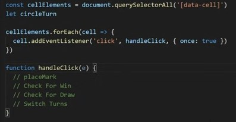

I then created a couple of constant variables which is the X_CLASS and the CIRCLE_CLASS. This way I can easily use these strings throughout the application without having to duplicate them all over the place.

I then added a constant variable of currentClass that tells the computer that if its circle turn then we want to return the circle class and if it's x's turn we want to return the X's class. 

  
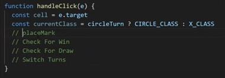

Next I added the code to place the mark, I actually just did this inside of a function. This was really easy I just added current class to the cell.

  
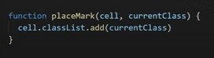

I then skipped check for win and check for draw for now as the switching turns was the most important thing to focus on. 

So I created a function called swapTurns which just takes circle turn and its going to set it to the opposite of circle. Now when I click it starts with X's turn and then circles turn and so on always swapping every single time.

  
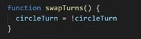

I then noticed that when I refreshed it and I hover over the empty grid I was not getting those hover effects. So I applied those hover effects by calling a function called setBoardHoverClass() and in this function I determine which class I'm going to apply. I set this function below the swapTurns function so that it knows which current player it is. I want the hover class to be based on who's turn it currently is, not on who's turn it used to be. I then selected the board by ID then removed X_CLASS from the board and CIRCLE_CLASS from the board. Then I put that if circles turn then apply circle class else if it's x's turn to add x class.

  
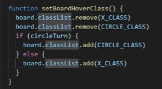

The first instance is not actually showing the board hover class so I called a function which is called startGame and inside of this function I set up all the cell elements and set the board hover class  set circle turn to equal false just to start. I then called the function startGame() at the beginning so that it's actually starting the game.

  
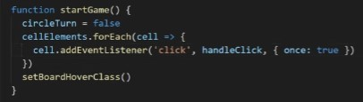

Now all that is left to do is to check for a win and check for a draw.

I created an array got all the winning combinations which is an array that is full of arrays. 
  
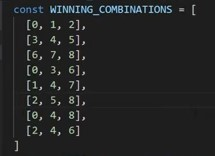

I then used this inside of a function here which is going to check if any of the winning combinations have been met by the current combinations by the same class. So if the current class is in all three of the elements inside of the combination then they are a winner.

  
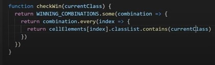

To check this worked I added console.log('winner') to the handleClick function temporarily. I tried a few winning combinations and could see that this works. 

  
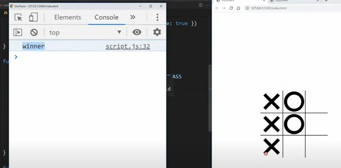

So now that works I needed to create a winning message so that the player knows there's been a win. 

In order to do that I added the function called endGame(draw) so that if else its not a draw then it will select the winning message text element. 
I created a constant variable for the winning message text element and used document.querySelector to select the data-winning-message-text div. 

  
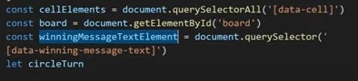

I then set the inner text to be equal to a string and check to see who's turn it is so if it's circles turn I want it to say that the 0's win and in x's win I want it to say that the X's win.
I also want the message to actually show when someone has won so I added that in too.

  
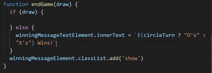

So now to add what happens if there is a draw.
So if endgame(draw) is true then its very similar to the above. I select the inner text of the winning message and set it as "Draw!"

I then set the function isDraw() to check that every single element is filled with an x or circle class with no winning combinations then it is a draw.
One problem is that the cell elements doesn't have every method but to get around that I just destructured the cellElements into an array so it had the method.

  
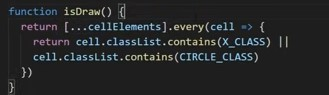

The last bit of functionality needed to be added is the restart button.
I added a constant variable called restartButton and got the restart button element by ID. I then added an event listener so that everytime it's clicked on it calls the startGame function.
  
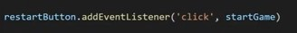

However when I click the restart button at this stage nothing happens. This is because the startGame function is not reversing the state of everything that's happened. It is setting everything up but it also needs to unset everything up.

The first thing I do is change the winning message element and remove the show class. This removed the show class however it didn't remove the other information in the table.

To remove that was really easy, I just needed to set a loop through all the cells, remove the X class and the same thing for the circle class and I also want to remove the handleClick event listener.
  
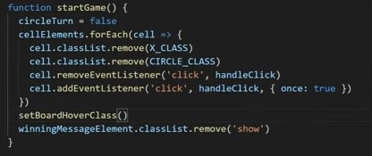

Now all the code is functioning exactly how I want it to. So now I want to make the website more accessible and there is where I ran into some trouble.
Because I used psuedo elements instead of actual text for the X's and O's this causes issues with screen readers as they don't exist within the HTML document, so they were basically completely invisible.

I did a little research into this

 https://html5accessibility.com/stuff/2020/11/07/not-so-short-note-on-aria-label-usage-big-table-edition/

 https://thewebdev.info/2021/08/21/what-is-the-equivalent-of-the-alt-attribute-for-div-elements/

 and with the help of one of the tutors at Code Institute I decided that the best I could do was add a role of "text" to the cell divs and then add an arialabel through Javascript. This was tested on the console and seemed to work so I assume it will work for screen readers. 

  
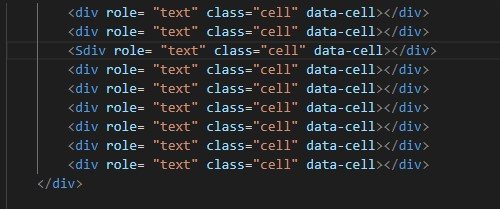

  
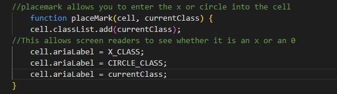

This was definetely a bit learning curve for me in accessibility and I would definetely not use psuedo elements in something I want to make accessible. What I used may seemed to have work but I'm not sure if it's up to A11Y accessibility standards.
## Technologies Used

 [HTML Formatter:](https://webformatter.com/html)
    -  HTML Formatter was used to beautify the code.

### Languages Used

-   [HTML5](https://en.wikipedia.org/wiki/HTML5)
-   [CSS3](https://en.wikipedia.org/wiki/Cascading_Style_Sheets)

### Frameworks and Programs Used

- [Git](https://git-scm.com/)
    - Git was used for version control by utilizing the Gitpod terminal to commit to Git and Push to GitHub.
-  [GitHub:](https://github.com/)
    - GitHub is used to store the projects code after being pushed from Git.
-  [Balsamiq:](https://balsamiq.com/)
    - Balsamiq was used to create the [wireframes](https://github.com/) during the design process.

## Debugging      
I ran the HTML code through the W3C validator and had no errors.

https://validator.w3.org/

And the CSS code ran through the Jigsaw validator with no errors.

https://jigsaw.w3.org/css-validator/

The Javascript code ran through the Jshint validator without any major issues although there was 59 warnings.

https://jshint.com/

The only errors coming back were that I missed a lot of semi-colons on the following lines of code:

12, 13, 23, 24,, 25, 26, 27, 28, 29, 31, 33, 37, 40, 41, 42, 43, 44, 45, 46, 50, 52, 53, 55, 57, 59, 60, 68, 70, 72, 79, 80, 84, 86, 87, 93, 98, 99, 101, 103, 111, 112, 113.

So I added semi-colons to all these lines detected.
The other error that came up was "'const' is available in ES6 (use 'esversion: 6') or Mozilla JS extensions (use moz)." which to my understanding is just an issue with the version of Jshint I was using not a bug in the code itself.

As far as I'm aware there are no bugs left in the code, although the accessibility would benefit from being worked on more!

## External Sources of Code

The tic tac toe game was built based on a youtube tutorial:

Build Tic Tac Toe With JavaScript - Tutorial
by Web Dev Simplified

https://www.youtube.com/watch?v=Y-GkMjUZsmM