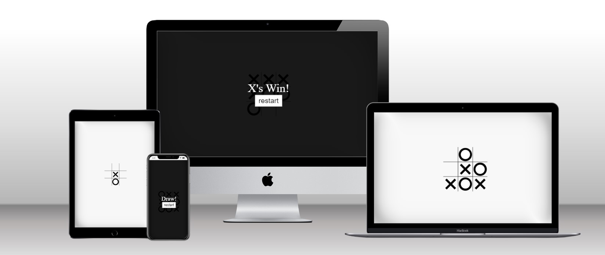

<p></p>

# TIC TAC TOE 

## Overview
This app was created for my second milestone project with The Code Institute where I demonstrate what I have learnt so far on their web development course. It is a interactive front end website using HTML, CSS and JavaScript. The websites goal is to be intuitive, user friendly, simple to use and fun. 

LIVE LINK : https://rebeccoder.github.io/milestone-project-two/index.html

## Table of contents

1. [UX](#ux)
    - [Visitor Goals](#visitor-goals)
    - [User Stories](#user-stories)
    - [Design Choices](#design-choices)
    - [Wireframes](#wireframes)

2. [Features](#features)

3. [Future Goals](#future-goals)

4. [Technology Used](#technology-used)

5. [Testing](#testing)

6. [UI](#ui)

7. [Issues and Resolutions](#issues-and-resolutions)

8. [Credits](#credits)


## UX (User Experience)

### Visitor Goals

The main target audience for the website are as follows:

- Groups of two to compete against eachother, couples or friends.
- The apps appearance is more suited for adults.
- Is suitable for total beginners as there is a instructions page.

The main visitor goals are as follows:

- Create an easy to use game for two people to play together online
- Allow the users to enter their names for a personalised expereience
- Have an instructions page for people who may have never played before
- To update the scoreboard so that users can keep track of their scores


### User Stories

- As a User I want to know the rules of the game
- As a User I want to be able to play against my componant 
- As a User I want to know who's turn it is 
- As a User I want to keep track of my score
- As a User I want to be notified when someone wins the game
- As a User I want to be able to reset the game without having to re-enter our names

## Design Choices

### Colours

The colour choices for the website were kept simple. Black and white with a bit of red for a statement colour. The hover effect was a dark grey colour for visibility. 


### Fonts

After playing around with a few fonts I decided to go with Oswald from Google fonts which is a sans-serif font. 
It is bold and thick yet very simplistic. The font really brought out the style I was going for.

### Styling

The styling for the game board was influenced from a youtube tutorial which I have credited below. 
The winning message was also a Sweet Alert message but I changed the buttons to black to match the monochrome style of the board.
All other styling in the wesbite is original CSS.


## Wireframes

The website was designed on a wireframe software called Balsamiq.


## Features

## Technologies Used

 [HTML Formatter:](https://webformatter.com/html)
    -  HTML Formatter was used to beautify the code.

 [Sweet Alerts:](https://sweetalert2.github.io/#download)
    -  I used sweet alerts for my winning message


### Languages Used

-   [HTML5](https://en.wikipedia.org/wiki/HTML5)
-   [CSS3](https://en.wikipedia.org/wiki/Cascading_Style_Sheets)
-   [JAVA SCRIPT](https://en.wikipedia.org/wiki/JavaScript)

### Frameworks and Programs Used

- [Git](https://git-scm.com/)
    - Git was used for version control by utilizing the Gitpod and Code Anywhere terminal to commit to Git and Push to GitHub.
-  [GitHub:](https://github.com/)
    - GitHub is used to store the projects code after being pushed from Git.
-  [Balsamiq:](https://balsamiq.com/)
    - Balsamiq was used to create the [wireframes](https://github.com/) during the design process.


## Testing      

### Validating Code

I ran the HTML code through the [W3C validator](https://validator.w3.org/) without any issues.

The CSS code ran through the [Jigsaw validator](https://jigsaw.w3.org/css-validator/) without any issues.

The Javascript code ran through the [Jshint validator](https://jshint.com/) with one error because the instructionsPage() is not called in the JS file, but it is being called in the HTML itself.

### Known Bugs
As far as I'm aware there are no bugs left in the code, although the accessibility would benefit from being worked on more!

## Deployment

### GitHub Pages

The project was deployed to GitHub Pages using the following steps...

1. Log in to GitHub and locate the [GitHub Repository](https://github.com/rebeccoder?tab=repositories)
2. At the top of the Repository (not top of page), locate the "Settings" Button on the menu.
    - Alternatively Click [Here](https://raw.githubusercontent.com/) for a GIF demonstrating the process starting from Step 2.
3. Scroll down the Settings page until you locate the "GitHub Pages" Section.
4. Under "Source", click the dropdown called "None" and select "Master Branch".
5. The page will automatically refresh.
6. Scroll back down through the page to locate the now published site [link](https://rebeccoder.github.io/milestone-project-two/index.html) in the "GitHub Pages" section.

### Forking the GitHub Repository

By forking the GitHub Repository we make a copy of the original repository on our GitHub account to view and/or make changes without affecting the original repository by using the following steps...

1. Log in to GitHub and locate the [GitHub Repository](https://github.com/)
2. At the top of the Repository (not top of page) just above the "Settings" Button on the menu, locate the "Fork" Button.
3. You should now have a copy of the original repository in your GitHub account.

### Making a Local Clone

1. Log in to GitHub and locate the [GitHub Repository](https://github.com/)
2. Under the repository name, click "Clone or download".
3. To clone the repository using HTTPS, under "Clone with HTTPS", copy the link.
4. Open Git Bash
5. Change the current working directory to the location where you want the cloned directory to be made.
6. Type `git clone`, and then paste the URL you copied in Step 3.

```
$ git clone https://github.com/rebeccoder/milestone-project-two
```

7. Press Enter. Your local clone will be created.

```
$ git clone https://github.com/rebeccoder/milestone-project-one
> Cloning into `CI-Clone`...
> remote: Counting objects: 10, done.
> remote: Compressing objects: 100% (8/8), done.
> remove: Total 10 (delta 1), reused 10 (delta 1)
> Unpacking objects: 100% (10/10), done.
```

Click [Here](https://help.github.com/en/github/creating-cloning-and-archiving-repositories/cloning-a-repository#cloning-a-repository-to-github-desktop) to retrieve pictures for some of the buttons and more detailed explanations of the above process.


## External Sources of Code

The tic tac toe game was built based on a youtube tutorial:

[Build Tic Tac Toe With JavaScript - Tutorial](https://www.youtube.com/watch?v=Y-GkMjUZsmM)
by Web Dev Simplified
